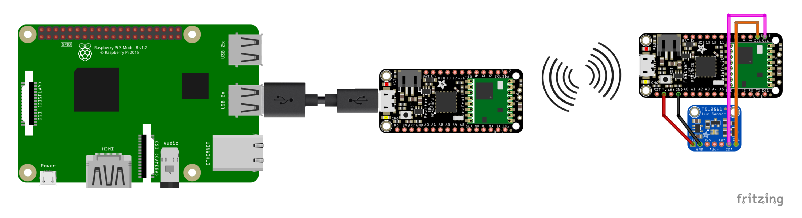

# LittleSense - RFM69 Node and Gateway
In this folder there are scripts to (i) setup node devices i.e. those which will collect sensor data and report it back via RFM69 radio, and (ii) receive data from these nodes and relay the data to a LittleSense server via a serial connection.

The image above should give you the basic idea. On the left is the [Raspberry Pi](https://www.raspberrypi.org/) which is running the LittleSense server. Connected to it via a USB lead is a [Adafruit Feather microcontroller with integrated RFM69 radio](https://www.adafruit.com/product/3076). This microcontroller is acting as a gateway, relaying communications between the RFM69 radio network and the LittleSense server. On the right you can see another [Adafruit Feather microcontroller with integrated RFM69 radio](https://www.adafruit.com/product/3076) which is collecting readings from a sensor (in this example a [Adafruit TSL2561 Digital Luminosity/Lux/Light Sensor](https://www.adafruit.com/product/439)) and transmitting them via the RFM69 radio to the gateway node.

## Scripts
Instructions for the various parts of this set up can be found below:.
* [Gateway Node](gateway/)
* [Sensor Node](node/)
* [LittleSense server](http://littlesense.readthedocs.io)
