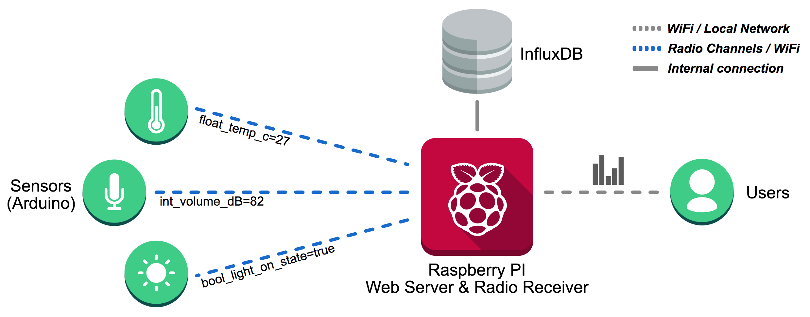

.. sensortank documentation master file, created by
   sphinx-quickstart on Mon Mar 12 14:37:40 2018.
   You can adapt this file completely to your liking, but it should at least
   contain the root `toctree` directive.

.. include:: global.rst

Welcome to |project| documentation!
===================================
So you want to deploy a bunch of sensors and store the data they produce locally? Well you 
have come to the right place. |project| was developed as a foundation on which novice and 
experienced programmers can develope bespoke sensor network applciations. Out of the box
|project| has all the code you need to sense, record and visualise data from any number of 
sensors. In addition the code has been specifically designed and written to make editing 
the layout and functionality easy.

At the heart of this project (and those of its creators) is the `Raspberry Pi <https://www.raspberrypi.org/>`_. 
The Pi acts as a server, listening for data (over WiFi or other radio technologies e.g. RFM69), storing the 
data it hears away in an timeseries obtimised database (`InfluxDB <https://www.influxdb.com/>`_) and presenting 
visualisations via web interface. In addition the project comes with a bunch of example sensor code which you can 
quickly deploy to microcontrollers like the Arduino.

Features
--------

- All the latest tech: Python 3, InfluxDB, Flask...
- One line deploy and update
- Example sensor code for Arduinos
- Communication via various Radios and WiFi
- Simple to expand and modify
- Well documented

Overview
========
So what does |project| do? Well in short you can through any number of key:value pairs at the server (along with a UTC time string and a unique sender device id) and the server will record them without question. The keys are made up from three parts: the data type (int, string, float), the variable name (e.g. light_level) and the unit of measurement (e.g. lux). An example key:value pair might look like float_light_level_lux=35. Formating the keys in this way allows |project| to automatically processes sensor data with zero configuration. 

Did you say it just records everything? Yes, but |project| only keeps the data of unregistered devices for a specified period, after which it automatically deletes them. You can easily register devices using the web interface. Using the web interface you or your users can also inspect and visuals the data through customisable dashboards. 

You can add your own visualisations easily and request data from the server by passing a JSON encoded list of device_id, variable name and aggregation function (e.g. max, mean) along with a start time, end time and interval period. The system will automatically aggregat the results, returning aggregated values for each variable for each interval in the specified time period. 

Contents
--------
The project is structured in two main section. We recomment starting by setting up the server.

.. toctree::
   :maxdepth: 2

   self
   server_install
   server_extra
   server_about
   customisation
   device
   utils
   exceptions
   api
   
About the code
--------------
The project code is designed for novice user to deploy and for novice programmers (e.g. academic researchers) to modify. As such we have chosen to use technologies which make the reading and adapting of the code less difficult, for example, we chose to use jQuery over more modern technologies such as React.js because the structure is more intuitive and there are fewer idependant technologies. In addition we have structured the project so that all relevant CSS and Javascript is contained within the tempalates. We chose to defy the convention of splitting code into seporate files so that it is obvious what code affects what and to maximise decoupling, thus minimising the chance of changes having unexpected consiquences elsewhere.

All the code you need can be found at: https://github.com/jkittley/LittleSense

Why |project|
-------------
For a breif moment we thought it was funny and also memorable domain names are hard to find. I'm sure one day we will regret it, but for now it stays.

Contribute
----------
- Issue Tracker: https://github.com/jkittley/|slug|/issues
- Source Code: https://github.com/jkittley/|slug|

Support
-------
If you are having issues, please let us know by submitting an issue.

License
-------
The project is licensed under the BSD license.

Indices and tables
==================

* :ref:`genindex`
* :ref:`modindex`
* :ref:`search`

