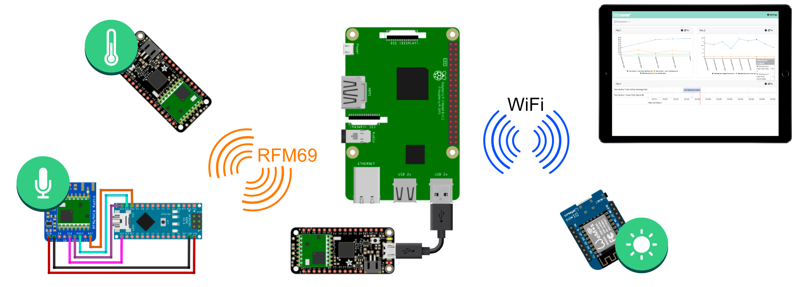

# Little Sense
Welcome to Little Sense! This project is designed to make the deployment of sensor devices and the subsequent logging and inspection of the data they produce simple. Our ambition is not to provide an all-in-one solution, rather we hope to provide a solid foundation on which you can build a bespoke system to suite your needs. 

The project is centered around a RasperryPi which acts as a web server and radio receiver. Sensor devices (based on Arduinos for example) can transmit data to the server via the web API or through any radio channel. Detailed documentation can be found here: http://littlesense.readthedocs.io and in each folder there is a readme file which contains some helpful information when modifying the code.

* Documentation: http://littlesense.readthedocs.io
* Website: http://littlesense.org

## Quick Overview
In short you can through key:value pairs at the server (along with a UTC time string and a unique sender device id) and the server will record them without question. Through a web interface, users can register devices for which they want to record data. Data from registered devices will be kept indefinitely. Unregistered device data will be held for a specified amount of time before they are automatically deleted. Using the web interface users can also inspect and visuals the data through customisable dashboards. 

